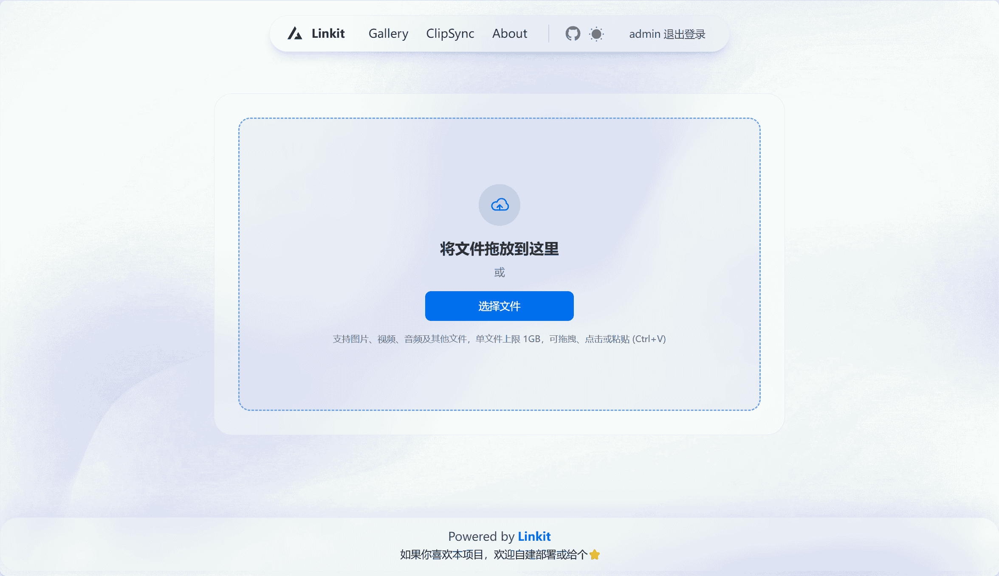
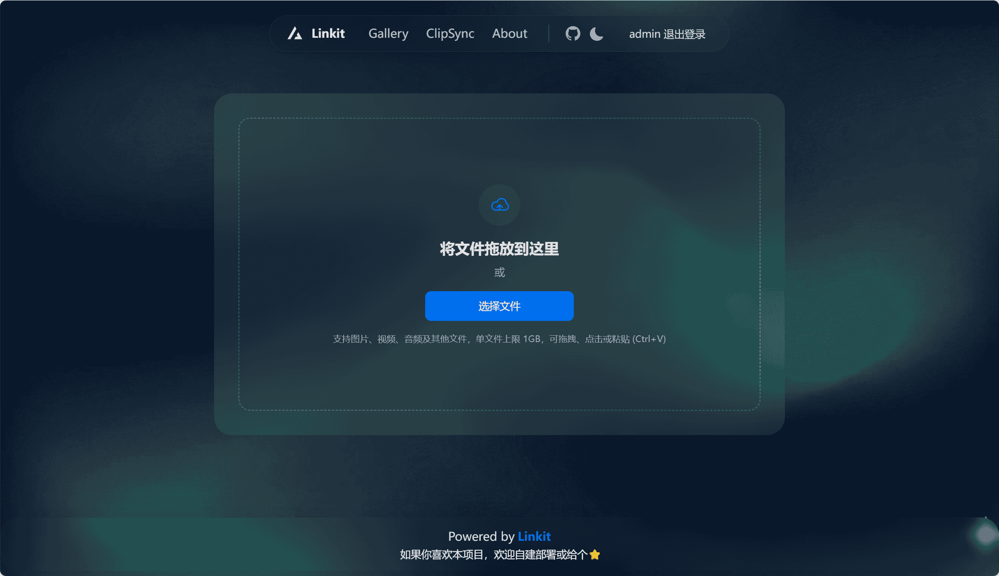
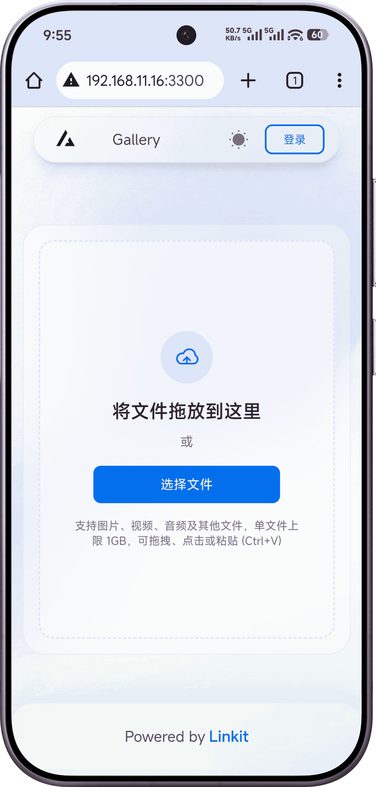
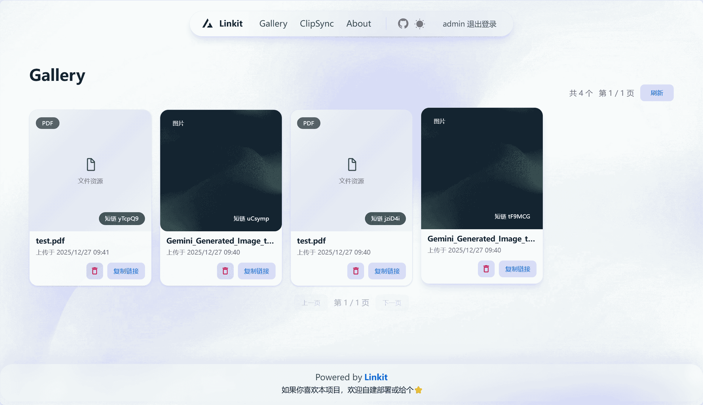
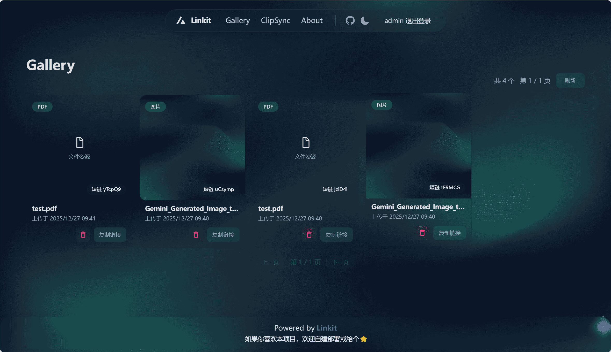
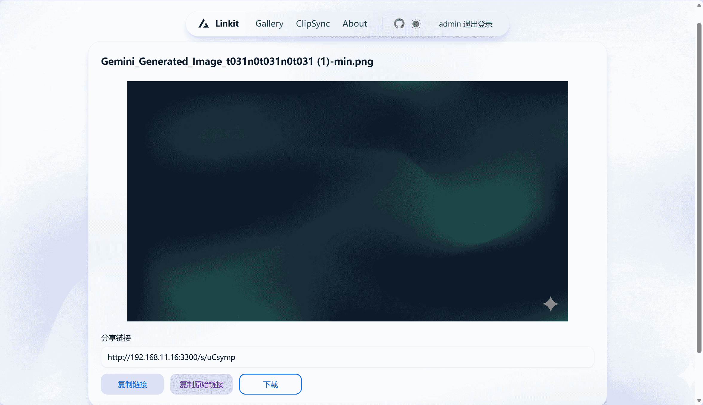

# Linkit
一个轻量级的文件分享&图床系统，上传文件 -> 获取分享码 -> 浏览器在线预览  
预览地址: 
* [https://linkit.waizx.com](https://linkit.waizx.com)  
* 分享：[https://linkit.waizx.com/s/nwFM9n](https://linkit.waizx.com/s/nwFM9n)  

**[一键部署](#docker-compose-部署-推荐)**


## Docker 部署
```bash
docker run -d --name linkit -p 3301:3301 -v "$PWD/data:/app/data" yangzxi/linkit:latest
```

### Docker Compose 部署 (推荐)
部署前，请先修改下方环境变量中的密码(**`ADMIN_PASSWORD`**，仅在首次启动时生效)
如果忘记密码，可以使用 **[重置命令](#重置-admin-密码)** 进行密码重置
```yaml
services:
  linkit:
    image: yangzxi/linkit
    container_name: linkit
    ports:
      - "3301:3301"
    volumes:
      - $PWD/data:/app/data
    environment:
      - TZ=Asia/Shanghai
      - ADMIN_PASSWORD=123123
      # - STORAGE_DRIVER=s3
```


## ✨ 项目介绍
- 暗黑模式支持、移动端支持
- 支持图片、音视频、Office等文件上传和预览
- 分享短链与直链访问
- 管理后台配置(`<host>/admin`)
- 本地存储 / S3 兼容存储
- 数据库自动备份。使用 S3 时，数据库每日自动备份到 `backup/yyyy_DD_mm_app.db`


## 界面预览








## 启动命令
### 重置 Admin 密码
```bash
docker exec -it linkit linkit reset-password <newpassword>
```


## 技术栈
- 后端：Go、Gin + SQLite
- 前端：React 19 + Vite + HeroUI + TailwindCSS 4
- 存储：本地文件系统 / S3 兼容对象存储


## 🚀 本地开发
### 启动后端
```bash
go run ./cmd
```

默认端口 `3301`，数据库路径 `./data/app.db`。  
如需 S3，提前配置环境变量（见下方）。

### 启动前端
```bash
cd pages
pnpm install
pnpm dev
```

前端开发服务默认端口 `3300`，已内置 `/api` 与 `/r` 代理到 `http://localhost:3301`。

### 访问
- 首页：`http://localhost:3300`
- 后台：`http://localhost:3300/admin`

### 默认管理员账号
首次启动会创建管理员账号（可用环境变量覆盖）
通过用户名和密码登录项目
- 用户名：`admin`
- 密码：`123123`
- 邮箱：`admin@example.com`
建议首次登录后立即通过后台修改密码，或在首次启动时通过环境变量指定账号密码。


## 常用环境变量
建议在启动应用后，通过后台管理界面进行配置
- `STORAGE_DRIVER`：默认 `local`。`local` 或 `s3`
- `S3_ENDPOINT`：S3 兼容服务地址
- `S3_REGION`：默认 `auto`
- `S3_BUCKET`：桶名称
- `S3_ACCESS_KEY`：访问密钥
- `S3_SECRET_KEY`：访问密钥
- `ADMIN_USERNAME`: 管理员账号，默认 `admin`
- `ADMIN_PASSWORD`: 管理员密码，默认 `123123`
- `ADMIN_EMAIL`: 管理员邮箱，默认 `admin@example.com`


## 打包&部署
```bash
chmod +x ./build.sh & ./build.sh
```
构建完成后：
- 后端可执行文件：`dist/linkit`
- 前端静态资源：`dist/public`

### Docker 镜像打包
Dockerfile 依赖 `dist` 目录产物，请先执行 `./build.sh`。
```bash
cd linkit
chmod +x ./build.sh & ./build.sh
docker build -t linkit .
docker run -p 3301:3301 -v "$PWD/data:/app/data" linkit
```

